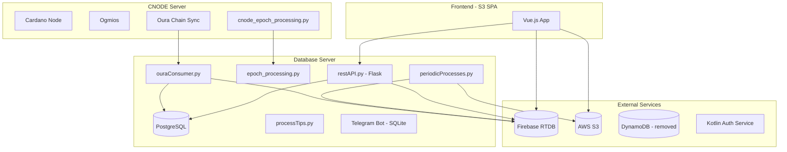
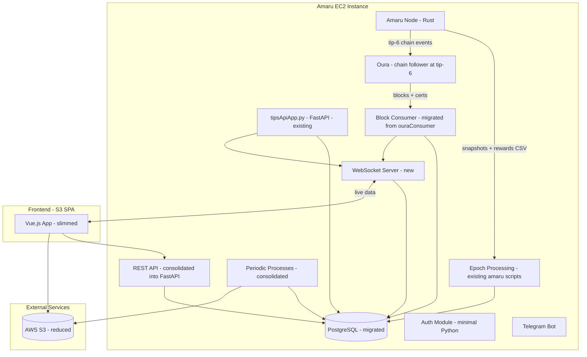
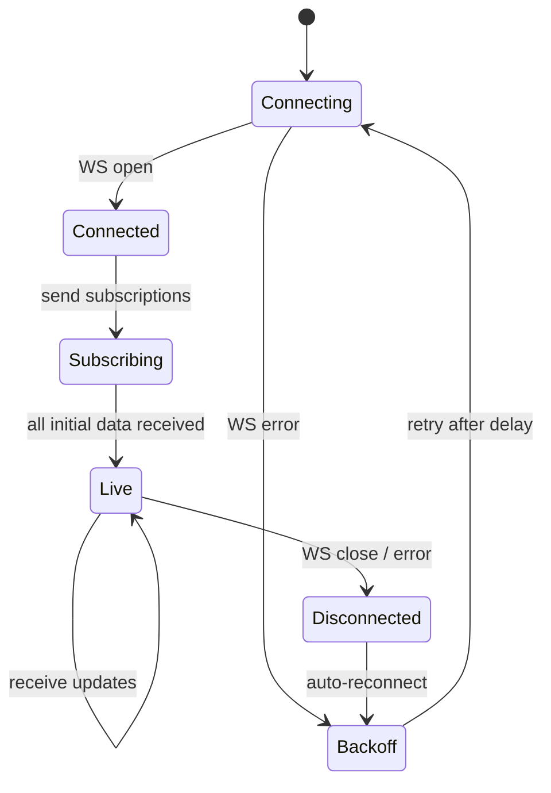
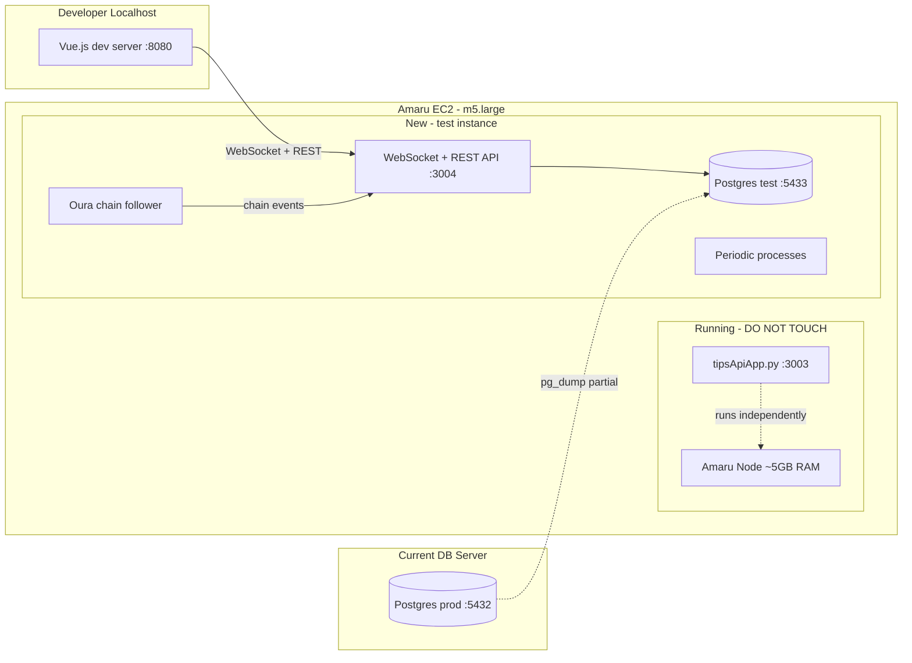
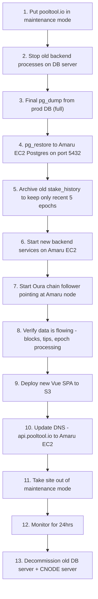

# PoolTool Full Rebuild Plan

## Current Architecture (being replaced)




## Target Architecture




---

## Phase 1: Front-End Feature Removal (Vue.js SPA)

Strip features from the front-end first. These changes are independent and can ship immediately to reduce Firebase reads.

### 1.1 Remove Delegators Tab

- **[PoolPage.vue](src/pages/PoolPage/PoolPage.vue)** lines 51-55: Delete the delegators `<v-tab>`
- **[router/index.js](src/router/index.js)** line 17: Delete `delegators` child route
- **[PoolDelegators.vue](src/pages/PoolPage/PoolDelegators.vue)**: Delete entire file

Eliminates S3 calls to `live_delegators_by_pool/`, `threeepoch_stake_gained_from/`, `threeepoch_stake_lost_to/`.

### 1.2 Remove News Feed and Pool Feed (Right Sidebar)

- **[App.vue](src/App.vue)**: Remove the right-side mini nav drawer (lines 186-228), `<pulse-block>` component (lines 304-310), mobile menu buttons (lines 11-28), and associated data/imports (`pulseVisible`, `pulseitem`, PulseBlock import)
- Delete entire files: `src/components/PulseBlock/PulseBlock.vue`, `src/components/PulseBlock/NewsFeed.vue`, `src/components/PulseBlock/PoolFeed.vue`
- Delete stylesheets: `src/styles/_pulse-block.scss`, `src/styles/_news-feed.scss`, `src/styles/_pool-feed.scss`

Eliminates 2 Firebase RTDB listeners (`newsfeed/items`, `all_pool_updates_blockfrost`).

### 1.3 Remove Portfolio Support from Pools Page

- **[PoolsPage.vue](src/pages/PoolsPage.vue)**: Remove portfolio autocomplete (lines 18-41), portfolio display card (lines 138-189), portfolio filtering (lines 730-733), computed properties (`portfolioitems`, `selectedPortfolio`, lines 545-577), route param init (line 441)
- **[App.vue](src/App.vue)** lines 1032-1043: Remove S3 fetch of `portfolios.json` and store commits
- **[store/index.js](src/store/index.js)**: Remove portfolio state (line 134), mutations (lines 501-503, 507-509), getters (lines 591-592)

Eliminates S3 fetch of `portfolios.json` on every app load.

### 1.4 Remove Consolidate Switch from Pools Page

- **[PoolsPage.vue](src/pages/PoolsPage.vue)**: Remove `<v-switch>` (lines 43-49), `poolsGrouped` computed (lines 578-584 -- replace with direct ref to `poolsfiltered`), `poolsGroupedObj` (lines 585-710), `groupPools` preference (lines 924-927). Remove all `if (this.groupPools)` branches in `tableheaders` (lines 968-1544), keeping only the non-grouped paths.
- **[PoolList.vue](src/components/PoolList.vue)**: Remove `grouplivestake`, `grouplivestakepercent` column templates
- **[pooltable.js](src/mixins/pooltable.js)**: Remove `grouplivestake`/`grouplivestakepercent` sort cases

### 1.5 Remove Live Stake (Replace with Active Stake)

- **[store/index.js](src/store/index.js)** line 63: Remove `live_stake` from `convertPool()`
- **[PoolPage.vue](src/pages/PoolPage/PoolPage.vue)** line 166: Remove `livestake` assignment
- **[PoolWidget.vue](src/components/PoolWidget.vue)**: Remove live stake display (lines 222-227), change `paintred` (line 737) to use `blockstake` (active stake), remove `minlivestake`/`maxlivestake` props
- **[PoolList.vue](src/components/PoolList.vue)**: Remove `livestake`, `livestakepercent` column templates
- **[PoolsPage.vue](src/pages/PoolsPage.vue)**: Remove live stake range slider, remove `livestake`/`livestakepercent` from default columns and `tableheaders`, update filtering to use active stake or remove
- **[HomePage.vue](src/pages/HomePage.vue)** line 696: Remove `livestake` column
- **[pooltable.js](src/mixins/pooltable.js)**: Remove `livestake`/`livestakepercent` sort cases, update `paintred` to use active stake
- **[SaturationCurve.vue](src/pages/PoolPage/SaturationCurve.vue)** line 191: Change `this.pool.livestake` to `this.pool.blockstake` for the "here" indicator

### 1.6 Limit Pool Epoch History Chart to 30 Epochs

- **[PoolPageHistory.vue](src/pages/PoolPage/PoolPageHistory.vue)**: In `poolhistory` computed (line 410), use `this.merged_history.slice(-30)` for chart data. Cap `maxepochs` (line 393) to `Math.min(existingValue, 29)`.

### 1.7 Limit Address History Chart to 30 Epochs (Keep Full Table)

- **[AddressDetail.vue](src/pages/AddressDetail.vue)**: In `addresshistory` computed (line 1380), use `this.ahist.slice(-30)` for chart data. Cap `maxepochs` (line 1374) to `Math.min(this.genesis.epoch - 213, 29)`.

---

## Phase 2: Backend Consolidation (New Unified Python Backend)

Consolidate `PoolToolBackend-CNODE`, `PoolToolBackend-DB`, and `amaru_scripts` into a single Python codebase on the Amaru EC2 instance. Postgres migrates to this same instance.

### 2.1 What Already Exists in amaru_scripts

These are **already working** and form the foundation:

- `**tipsApiApp.py**` (2175 lines) -- FastAPI service handling:
  - `POST /sendtips` -- live block tip reporting from pool operators (replaced DynamoDB + processTips.py)
  - `POST /sendslots` -- assigned slot reporting
  - Background `process_tips_loop()` -- processes tips every second, writes sync data, histograms, competitive blocks to Firebase + S3 + Postgres
  - VRF validation via libsodium
  - Auth cache from Postgres (`api_user_table`, `api_pool_table`)
  - Rate limiting, DDoS protection
- `**amaru_epoch_processing.py**` -- monitors Amaru for epoch transitions, orchestrates:
  - `extractEpochParams.py` -- extract protocol params from rewards summary JSON
  - `extractRewardsData.py` -- process rewards CSV from Amaru, write to Postgres + Firebase
  - `extractSnapshotData.py` -- process CBOR snapshots from Amaru, write pool/stake data
  - Price fetching via CoinGecko
- `**sync_api_tables.py**` -- syncs Firebase user auth data to Postgres (one-time migration tool)

### 2.2 What Needs to Be Built / Migrated

#### A. WebSocket Server (replaces Firebase RTDB)

This is the **most critical new component**. The Vue front-end currently uses ~31 `$rtdbBind` calls across 15 files. These all need to be replaced with WebSocket subscriptions.

**Data channels the WebSocket server must provide:**


| Channel                              | Current Firebase Path                | Used By                | Update Frequency      |
| ------------------------------------ | ------------------------------------ | ---------------------- | --------------------- |
| `pools`                              | `stake_pools/`                       | Vuex store (all pages) | On block/epoch events |
| `pool_stats/{id}`                    | `pool_stats/{id}`                    | PoolPage.vue           | On pool page load     |
| `pool_stats/{id}/blocks`             | `pool_stats/{id}/blocks`             | PoolPageHistory.vue    | Per epoch             |
| `pool_stats/{id}/assigned_slots`     | `pool_stats/{id}/assigned_slots`     | PoolPageHistory.vue    | Per epoch             |
| `pool_stats/{id}/delegators_rewards` | `pool_stats/{id}/delegators_rewards` | PoolPageHistory.vue    | Per epoch             |
| `pool_stats/{id}/pool_fees`          | `pool_stats/{id}/pool_fees`          | PoolPageHistory.vue    | Per epoch             |
| `pool_stats/{id}/ros`                | `pool_stats/{id}/ros`                | PoolPageHistory.vue    | Per epoch             |
| `pool_stats/{id}/stake`              | `pool_stats/{id}/stake`              | PoolPageHistory.vue    | Per epoch             |
| `recent_block`                       | `recent_block`                       | Vuex store (global)    | Every ~20s            |
| `epoch_data`                         | `epochs/{epoch}`                     | Vuex store (global)    | Every block           |
| `epoch_params`                       | `epoch_params/{epoch}`               | Vuex store (global)    | Per epoch             |
| `ecosystem`                          | `ecosystem`                          | Vuex store (global)    | Hourly                |
| `syncdata`                           | `syncdata`                           | Vuex store (global)    | Every second          |
| `active_stake`                       | `total_active_stake/{epoch}`         | Vuex store (global)    | Per epoch             |
| `stake_hist/{address}`               | `stake_hist/{address}`               | AddressDetail.vue      | On page load          |
| `pool_blocks/{id}/{epoch}`           | `pool_blocks/{id}/{epoch}`           | PoolBlocks.vue         | Every block           |
| `blocks/{epoch}`                     | `blocks/{epoch}`                     | RecentBlocks.vue       | Every block           |
| `awards/{id}`                        | `awards/cardano/{id}`                | PoolAwards.vue         | On block events       |
| `epoch_exchange_rates`               | `epoch_exchange_rates`               | AddressDetail.vue      | Per epoch             |
| `heights`                            | `stake_pool_columns/heights`         | Vuex store             | Every block           |
| `languages`                          | `languages`                          | Vuex store             | Rarely                |
| `admin_message`                      | `admin_message/web`                  | Vuex store             | Rarely                |
| `user_data`                          | `users/privMeta/{userId}`            | UserManagement         | On login              |


**Design: Dual-layer approach (REST for bulk data + WebSocket for live updates)**

Every data channel has two parts:

1. A **REST endpoint** that returns the full current dataset (used on initial load and reconnect)
2. A **WebSocket subscription** that pushes incremental updates after the initial load

This cleanly separates concerns: REST handles the heavy lift of bulk data; WebSocket handles lightweight real-time deltas.

---

**WebSocket Lifecycle**




1. **Connect:** Client opens `wss://api.pooltool.io/ws`. Server assigns a connection ID, starts heartbeat (ping/pong every 30s).
2. **Subscribe:** Client sends subscribe messages for each channel it needs. Example:
  ```json
   {"action": "subscribe", "channel": "recent_block"}
   {"action": "subscribe", "channel": "pool_stats", "params": {"pool_id": "abc123"}}
  ```
3. **Initial data push:** On subscribe, the server queries Postgres for the full current state and pushes it as the first message on that channel. This is equivalent to calling the REST endpoint -- the client gets a complete snapshot, not a delta.
4. **Live updates:** After the initial push, the server sends only deltas/updates as they occur. Messages include a monotonic sequence number per channel so the client can detect gaps.
  ```json
   {"channel": "recent_block", "seq": 42, "data": {...}}
  ```
5. **Disconnect / reconnect:** On WebSocket close or error, the client reconnects with exponential backoff (1s, 2s, 4s, 8s... max 30s). On reconnect, the client re-subscribes to all channels. Each re-subscribe triggers a fresh full data push from the server (step 3), so any data that went stale during the outage is fully replaced.
6. **Unsubscribe:** When navigating away from a page (e.g., leaving pool page), client sends:
  ```json
   {"action": "unsubscribe", "channel": "pool_stats", "params": {"pool_id": "abc123"}}
  ```
   Server stops sending updates for that channel and frees resources.
7. **Heartbeat:** Server sends ping every 30s. If no pong within 10s, server closes connection. Client-side: if no message received for 45s, assume dead connection and reconnect.

---

**REST Endpoints for Bulk Data**

Each channel has a corresponding REST endpoint. These are used:

- By the WebSocket server itself to serve initial subscription data
- Directly by the client if WebSocket is unavailable (graceful fallback)
- For SEO/crawlers that can't use WebSocket


| REST Endpoint                   | Method | Returns                                                                               | Corresponds to WS Channel            |
| ------------------------------- | ------ | ------------------------------------------------------------------------------------- | ------------------------------------ |
| `/api/pools`                    | GET    | All non-retired pool data (the full `stake_pools` dataset)                            | `pools`                              |
| `/api/pool/{id}`                | GET    | Single pool stats (description, metadata, homepage, etc.)                             | `pool_stats/{id}`                    |
| `/api/pool/{id}/history`        | GET    | Per-epoch history (blocks, slots, rewards, fees, ros, stake). Query param `?limit=30` | `pool_stats/{id}/*` (6 sub-channels) |
| `/api/pool/{id}/blocks/{epoch}` | GET    | Blocks minted by pool in given epoch                                                  | `pool_blocks/{id}/{epoch}`           |
| `/api/pool/{id}/awards`         | GET    | Pool awards                                                                           | `awards/{id}`                        |
| `/api/blocks/{epoch}`           | GET    | All blocks in an epoch                                                                | `blocks/{epoch}`                     |
| `/api/recent_block`             | GET    | Most recent block info                                                                | `recent_block`                       |
| `/api/epoch/{epoch}`            | GET    | Epoch summary (blocks, fees, tx count, etc.)                                          | `epoch_data`                         |
| `/api/epoch_params/{epoch}`     | GET    | Protocol parameters for epoch                                                         | `epoch_params`                       |
| `/api/ecosystem`                | GET    | Global ecosystem stats                                                                | `ecosystem`                          |
| `/api/syncdata`                 | GET    | Current sync status, histogram                                                        | `syncdata`                           |
| `/api/active_stake/{epoch}`     | GET    | Total active stake for epoch                                                          | `active_stake`                       |
| `/api/stake_hist/{address}`     | GET    | Full stake history for address                                                        | `stake_hist/{address}`               |
| `/api/epoch_exchange_rates`     | GET    | ADA prices per epoch                                                                  | `epoch_exchange_rates`               |
| `/api/heights`                  | GET    | Current block heights per pool                                                        | `heights`                            |
| `/api/languages`                | GET    | Translation strings                                                                   | `languages`                          |
| `/api/admin_message`            | GET    | Admin broadcast message                                                               | `admin_message`                      |
| `/api/user/{userId}`            | GET    | User data (authenticated)                                                             | `user_data`                          |


---

**Server-Side Update Triggers**

Each backend process that modifies data is responsible for pushing updates to subscribed WebSocket clients. The WebSocket server maintains a registry of `channel -> set of connected clients`.


| Trigger Source                               | Channels Updated                                                                                                        | When                            |
| -------------------------------------------- | ----------------------------------------------------------------------------------------------------------------------- | ------------------------------- |
| `process_tips_loop` (tipsApiApp.py)          | `syncdata`, `heights`                                                                                                   | Every ~1 second                 |
| Block consumer (from Oura)                   | `recent_block`, `epoch_data`, `blocks/{epoch}`, `pool_blocks/{id}/{epoch}`, `pools` (block count update), `awards/{id}` | Every new block (~20s)          |
| Epoch processing (amaru_epoch_processing.py) | `pool_stats/{id}/*` (all 6 history channels), `epoch_params`, `active_stake`, `ecosystem`, `epoch_exchange_rates`       | At epoch boundary (~5 days)     |
| Periodic processes                           | `pools` (metadata/relay changes), `ecosystem` (relay stats)                                                             | Hourly                          |
| pivotRewards                                 | `stake_hist/{address}`                                                                                                  | On demand (after user requests) |
| User actions                                 | `user_data`                                                                                                             | On login, settings change       |


**Internal pub/sub mechanism:** Use a simple in-process pub/sub (Python `asyncio.Queue` per client, or a broadcast pattern). When a backend process writes data, it calls `ws_manager.broadcast(channel, data)` which fans out to all subscribed clients. No external message broker needed since everything runs on one server.

```python
# Pseudocode for the broadcast pattern
class WSManager:
    # channel -> set of (websocket, last_seq)
    subscriptions: dict[str, set[WebSocket]]
    
    async def subscribe(self, ws, channel, params=None):
        self.subscriptions[channel].add(ws)
        # Push full initial state
        data = await self.fetch_full_state(channel, params)
        await ws.send_json({"channel": channel, "seq": 0, "type": "snapshot", "data": data})
    
    async def broadcast(self, channel, data):
        for ws in self.subscriptions[channel]:
            await ws.send_json({"channel": channel, "seq": next_seq(), "type": "update", "data": data})
```

**Message types:**

- `snapshot` -- full dataset replacement (on subscribe and reconnect)
- `update` -- incremental change (new block added, pool field changed, etc.)
- `delete` -- item removed (rare, e.g., pool retired)

---

**Front-End WebSocket Client (`src/services/websocket.js`)**

```javascript
// Pseudocode for the client-side service
class PoolToolWebSocket {
  constructor(url) {
    this.url = url
    this.subscriptions = new Map()  // channel -> {params, callback}
    this.backoff = 1000
    this.connect()
  }

  connect() {
    this.ws = new WebSocket(this.url)
    this.ws.onopen = () => {
      this.backoff = 1000
      // Re-subscribe to all active channels (handles reconnect)
      for (const [channel, {params}] of this.subscriptions) {
        this.ws.send(JSON.stringify({action: 'subscribe', channel, params}))
      }
    }
    this.ws.onmessage = (event) => {
      const msg = JSON.parse(event.data)
      const sub = this.subscriptions.get(msg.channel)
      if (sub) sub.callback(msg)  // msg.type is 'snapshot' or 'update'
    }
    this.ws.onclose = () => setTimeout(() => this.connect(), this.backoff)
    this.ws.onerror = () => { this.backoff = Math.min(this.backoff * 2, 30000) }
  }

  subscribe(channel, params, callback) {
    this.subscriptions.set(channel, {params, callback})
    if (this.ws.readyState === WebSocket.OPEN) {
      this.ws.send(JSON.stringify({action: 'subscribe', channel, params}))
    }
    // If not open yet, will subscribe on next onopen (reconnect)
  }

  unsubscribe(channel) {
    this.subscriptions.delete(channel)
    if (this.ws.readyState === WebSocket.OPEN) {
      this.ws.send(JSON.stringify({action: 'unsubscribe', channel}))
    }
  }
}
```

Key behaviors:

- On **initial page load**: Vuex store creates the WebSocket, subscribes to global channels (`pools`, `recent_block`, `syncdata`, `epoch_data`, `ecosystem`, etc.). Receives `snapshot` messages and populates state.
- On **page navigation** (e.g., entering pool page): component subscribes to page-specific channels (`pool_stats/{id}`, etc.). On leaving, unsubscribes.
- On **disconnect/reconnect**: all active subscriptions are re-sent on `onopen`, server responds with fresh `snapshot` for each, completely replacing any stale data.
- On **visibility change** (tab hidden/shown): optionally pause/resume subscriptions to save bandwidth when tab is backgrounded.

#### B. Migrate periodicProcesses.py

From `PoolToolBackend-DB/periodicProcesses.py`. Currently runs on the DB server with these scheduled tasks:


| Task                      | Period    | Keep?    | Notes                                                                                         |
| ------------------------- | --------- | -------- | --------------------------------------------------------------------------------------------- |
| `update_pool_ranking`     | ~1 hour   | **Drop** | Daedalus pool ranking -- no longer displayed on front-end, remove from backend entirely.      |
| `update_metadata`         | ~1 hour   | Yes      | Fetches and verifies pool metadata URLs. Change Firebase writes to WebSocket pushes.          |
| `update_pool_relays`      | ~1 hour   | Yes      | Tests relay connectivity via `cardano-cli ping`. Change Firebase writes to WebSocket pushes.  |
| `write_tickers`           | ~1 hour   | **Drop** | Ticker data already in Postgres. Serve via REST/WebSocket. Eliminates ~400KB hourly S3 write. |
| `battle_trends`           | ~1 hour   | Yes      | Calculates battle stats from Postgres. Change Firebase writes to WebSocket pushes.            |
| `check_pledge_violations` | ~24 hours | Yes      | Checks pledge compliance, sends push notifications. Keep as-is.                               |


Integrate as async background tasks in the FastAPI app or as a separate long-running process.

#### C. Migrate Chain-Following / Block Processing

**Two distinct data flows exist today:**

1. **Operator-reported tips** (`tipsApiApp.py` `/sendtips`): Pool operators report which block height they see, their VRF proofs, sync status, etc. This powers the histogram, competitive block analysis, and sync status display. **This already works and stays as-is.**
2. **Authoritative chain data** (Oura at tip-6): The *actual* block contents -- who minted each block, transactions, fees, certificates (pool registrations, delegations, retirements) -- come from following the chain via Oura, configured to trail 6 blocks behind the tip to avoid rollback complications. Oura posts events to `ouraConsumer.py` which writes to Postgres and Firebase via `consumerTools.py`.

**For the new backend, we still need a chain follower.** Options:

- **Option A: Keep Oura** -- Oura is lightweight and already proven. It can follow either the Amaru node or another Cardano node. The `ouraConsumer.py` Flask endpoint just needs to be ported to the Amaru EC2 instance and updated to write to WebSocket pushes instead of Firebase. This is the lowest-risk path.
- **Option B: Follow Amaru directly** -- If Amaru exposes a streaming API or mini-protocol for chain events, we could subscribe directly. This eliminates the Oura dependency but requires Amaru to support it.
- **Option C: Hybrid** -- Use Amaru for epoch-boundary data (snapshots, rewards -- already working via `amaru_epoch_processing.py`) and Oura for real-time block-by-block chain following.

**Decision: Option C (hybrid).** Keep Oura for real-time chain following since it's proven and lightweight, while using Amaru's native output for epoch processing. Migrate `ouraConsumer.py` + `consumerTools.py` to the Amaru EC2 instance.

**Functions to migrate from consumerTools.py:**

- `consumeBlock` -- block insertion to Postgres, pool block count updates, awards, Telegram notifications. Replace Firebase writes with WebSocket pushes.
- `consumeBlockEnd` -- final block details (fees, output, size). Replace Firebase writes with WebSocket pushes.
- `consumeTransaction` -- fee/execution unit tracking. Also handles verification payment detection (watching specific addresses). **Must replace Demeter db-sync queries with local Postgres lookups** (see "No Demeter db-sync" section below).
- `consumeTxInput` -- currently a no-op (`pass`). **Must now write transaction input data to Postgres** (`tx_inputs` table: tx_hash, input_index, address, amount). This replaces Demeter db-sync for resolving transaction input addresses.
- `consumeTxOutput` -- tracks block-level output totals. **Extend to also write per-output address data to Postgres** for verification payment matching.
- `consumePoolRegistration` -- pool parameter change tracking. Replace Firebase writes with WebSocket pushes.
- `consumeStakeDelegation` -- delegation tracking (updates `live_delegators` table).
- `consumeStakeDeRegistration` -- de-registration tracking.
- `consumePoolRetirement` -- retirement tracking.
- `epochProcessing` -- epoch boundary trigger. **Already replaced by `amaru_epoch_processing.py**`.

#### D. Migrate REST API

From `PoolToolBackend-DB/restAPI.py`. Add these endpoints to the existing FastAPI app:


| Endpoint             | Keep?    | Notes                                                                  |
| -------------------- | -------- | ---------------------------------------------------------------------- |
| `POST /pivotrewards` | Yes      | See detailed flow below.                                               |
| `POST /login`        | Yes      | Rewrite to use Postgres instead of Firebase for password verification. |
| `POST /queryaddress` | Yes      | Already queries Postgres. Just add to FastAPI.                         |
| `POST /zapier*`      | **Drop** | All Zapier endpoints removed per decision.                             |


**pivotRewards flow (updated for WebSocket):**

Currently the front-end (`AddressDetail.vue`) calls `POST /v1/pivotrewards` with a stake key, then binds to `Firebase stake_hist/{address}` and waits for data to appear. The backend spawns `pivotRewards.py` which crunches the reward data and writes results to Firebase, which then pushes to the front-end automatically.

In the new architecture:

1. Front-end opens a WebSocket subscription to `stake_hist/{address}`
2. Front-end calls `POST /pivotrewards` with the stake key
3. Backend runs the pivot async (query Postgres, calculate per-epoch reward breakdown)
4. When complete, backend writes results to Postgres and pushes the full dataset to the WebSocket channel `stake_hist/{address}`
5. Front-end receives the push and renders the data

This keeps the same UX (user sees a loading state, then data appears) but replaces the Firebase round-trip with a direct WebSocket push. The front-end does not need to re-query -- the server pushes the complete result over the already-subscribed channel.

#### E. Migrate User Accounts to Postgres

Currently users are stored in Firebase (`users/auth/`, `users/privMeta/`, `users/pubMeta/`). `sync_api_tables.py` already migrates API keys and pool ownership.

**New Postgres tables needed:**

- `users` -- user_id (UUID), password_hash, created_at, authority, email
- `user_addresses` -- user_id, stake_key
- `user_pools` -- user_id, pool_id (already exists as `api_pool_table`)
- `user_api_keys` -- user_id, api_key (already exists as `api_user_table`)
- `user_settings` -- user_id, settings_json (favorites, preferences)
- `user_alerts` -- user_id, pool_id, alert_type, fcm_token (for push notifications)

**Migration steps:**

1. Run `sync_api_tables.py` to sync API keys/pools (already done)
2. Write a one-time script to export remaining Firebase user data to Postgres
3. Update login endpoint to authenticate against Postgres
4. Update front-end auth to use REST API instead of Firebase Auth

#### F. Minimal Auth Module (Replace Kotlin Authenticator)

The Kotlin `CardanoStakeholderAuthenticator` provides stake key verification for pool claiming. Rewrite as a simple Python module:

- **Verify ownership:** Pool operator signs a challenge message with their stake key. Verify signature using `pycardano` or `libsodium` (already loaded in tipsApiApp.py).
- **Endpoints:** `POST /auth/verify/{address}` (submit signed challenge), `GET /auth/status/{address}` (check verification status)
- Store verification status in Postgres (`user_addresses` table with `verified` boolean)
- No need for the full CSAS protocol -- just sign-and-verify for PoolTool's pool claiming flow

#### G. Telegram Bot

Keep the Telegram bot. Currently triggered via `awsbroadcast` (SNS) from `consumerTools.py`. In the new architecture:

- Block production notifications: trigger directly from `tipsApiApp.py` when a new block is confirmed (already has pool info)
- Award notifications: trigger from the same block processing code
- Replace SNS `awsbroadcast` with direct function calls since everything is on one server now
- Migrate the SQLite bot database to Postgres or keep SQLite (it's lightweight)

---

## Phase 3: Front-End Firebase Replacement

After the WebSocket server is running, replace all Firebase bindings in the Vue app.

### 3.1 Create WebSocket Client Service

New file: `src/services/websocket.js`

- Manages a single WebSocket connection to the backend
- Provides `subscribe(channel, callback)` / `unsubscribe(channel)` API
- Auto-reconnect with exponential backoff
- Replaces `src/firebase.js`

### 3.2 Replace Vuex Store Firebase Bindings

**[store/index.js](src/store/index.js)** -- the biggest change:

- Remove `vuexfire` dependency and `vuexfireMutations`
- Remove all `firebaseAction` bindings (`bindPools`, `bindPoolsRetired`, `bindSinglePool`, `bindGenesis`, `bindUserData`)
- Replace with WebSocket subscriptions that commit mutations on message receipt
- The `convertPool` function stays -- it just receives data from WebSocket instead of Firebase snapshots
- Pool data flow: WebSocket `pools` channel -> `processPool()` -> Vuex state (same logic, different source)

### 3.3 Replace Per-Page Firebase Bindings

Each page that uses `$rtdbBind` needs to switch to the WebSocket service:

- **PoolPageHistory.vue** (6 bindings) -- subscribe to `pool_stats/{id}/*` channels
- **PoolPage.vue** (1 binding) -- subscribe to `pool_stats/{id}`
- **AddressDetail.vue** (2 bindings) -- subscribe to `stake_hist/{address}`, `epoch_exchange_rates`
- **RecentBlocks.vue** (3 bindings) -- subscribe to `blocks/{epoch}`
- **HomePage.vue** (4 bindings) -- subscribe to pool-specific channels for favorites
- **PoolBlocks.vue** (1 binding) -- subscribe to `pool_blocks/{id}/{epoch}`
- **PoolOrphans.vue** (1 binding) -- subscribe to competitive blocks data
- **PoolAwards.vue** (2 bindings) -- subscribe to `awards/{id}`
- **AboutPage.vue** (1 binding) -- subscribe to ecosystem stats
- **UserManagement.vue** (3 bindings) -- REST API calls for user data
- **AdminPage.vue** (2 bindings) -- REST API calls for admin data
- **TranslationPage.vue** (2 bindings) -- REST API calls for language data

### 3.4 Remove Firebase Dependencies

- Delete `src/firebase.js`
- Remove `firebase`, `vuefire`, `vuexfire` from `package.json`
- Remove Firebase messaging/notification setup from `App.vue` (replace with REST-based push notification registration)

---

## Phase 4: Infrastructure Migration

### 4.1 Migrate Postgres to Amaru EC2

- pg_dump from current DB server, pg_restore on Amaru EC2
- Update all connection strings (currently hardcoded as `172.31.39.49` in amaru_scripts)
- Change to `localhost` since Postgres will be on the same machine

### 4.2 Consolidate Services

Final service layout on Amaru EC2:


| Service      | Description                       | Port     |
| ------------ | --------------------------------- | -------- |
| Amaru Node   | Rust Cardano node                 | 6000     |
| PoolTool API | FastAPI (tips + REST + WebSocket) | 3003     |
| PostgreSQL   | Database                          | 5432     |
| Telegram Bot | Notification service              | internal |


### 4.3 DNS / Networking

- Point `api.pooltool.io` to the Amaru EC2 instance
- Add WebSocket endpoint (e.g., `wss://api.pooltool.io/ws`)
- Keep S3 serving static assets for the SPA and reduced static data files

---

## S3 Data Inventory (What's Written and What's Needed)

Complete audit of every file/directory regularly written to `data.pooltool.io` S3 bucket:

**KEEP -- still needed by front-end or operations:**


| S3 Path                                 | Written By                        | Frequency                      | Size          | Front-End Consumer                       | Notes                                        |
| --------------------------------------- | --------------------------------- | ------------------------------ | ------------- | ---------------------------------------- | -------------------------------------------- |
| `blockdata/{dir}/C_{hash}.json`         | tipsApiApp.py (process_tips_loop) | Every competitive block (~20s) | ~1-5KB each   | PropDelayChart.vue, competitiveBlock.vue | Competitive block analysis data              |
| `blockdata/{dir}/C_{hash}.png`          | tipsApiApp.py                     | Every competitive block        | ~10-50KB each | PropDelayChart.vue                       | Propagation delay chart images               |
| `blockdata/{dir}/F_{hash}.png`          | tipsApiApp.py                     | Every competitive block        | ~10-50KB each | miniPropDelayChart.vue                   | Fast propagation chart images                |
| `blockdata/{dir}/{hash}.json`           | tipsApiApp.py                     | Every tip hash processed       | ~1-5KB each   | NetworkHealth.vue                        | Tip timing data per block                    |
| `blockdata/{dir}/{hash}.png`            | tipsApiApp.py                     | Every tip hash processed       | ~10-50KB each | NetworkHealth.vue                        | Histogram images                             |
| `stats/stats.json`                      | tipsApiApp.py                     | Every 15 seconds               | ~1KB          | NetworkHealth.vue                        | Current sync stats                           |
| `stats/syncd.json`                      | tipsApiApp.py                     | Every 15 seconds               | ~5KB          | NetworkHealth.vue                        | Sync status data                             |
| `stats/heights.json`                    | tipsApiApp.py                     | Every 15 seconds               | ~50-100KB     | NetworkHealth.vue                        | All pool tip heights                         |
| `stats/battledata.json`                 | processOrphans.py                 | Continuously                   | ~50KB         | DecentralizationBlock.vue                | Current battle data                          |
| `stats/trendingbattles.json`            | periodicProcesses.py              | Hourly                         | ~5KB          | DecentralizationBlock.vue                | Battle trend history                         |
| `stats/byepoch/{epoch}/syncd.json`      | tipsApiApp.py                     | Every 15 seconds               | ~5KB          | --                                       | Per-epoch sync archive                       |
| `stats/byepoch/{epoch}/battledata.json` | processOrphans.py                 | Continuously                   | ~50KB         | --                                       | Per-epoch battle archive                     |
| `stats/pools/{id}/by_producer.json`     | calculatePropDelays.py            | Per epoch                      | ~1-5KB        | PoolMetrics.vue                          | Prop delay by producer                       |
| `stats/pools/{id}/by_receiver.json`     | calculatePropDelays.py            | Per epoch                      | ~1-5KB        | PoolMetrics.vue                          | Prop delay by receiver                       |
| `{network}/blocks/{epoch}/{block}.json` | consumerTools.py                  | Every block (~20s)             | ~1KB each     | --                                       | Block data archive (used by S3 block lookup) |
| `md/{pool_id}`                          | Pool operators                    | On upload                      | Varies        | PoolManage.vue                           | Extended pool metadata JSON files            |


**DROP -- features being removed or can move to Postgres + WebSocket:**


| S3 Path                                                          | Written By                           | Frequency           | Size              | Why Drop                                                                                                                                                      |
| ---------------------------------------------------------------- | ------------------------------------ | ------------------- | ----------------- | ------------------------------------------------------------------------------------------------------------------------------------------------------------- |
| `stats/tickers.json`                                             | periodicProcesses.py (write_tickers) | Hourly              | ~200KB            | Only consumed by NetworkHealth.vue for ticker lookups. Can serve from Postgres via REST/WebSocket instead. Eliminates hourly S3 write + Firebase hash update. |
| `stats/tickers2.json`                                            | periodicProcesses.py (write_tickers) | Hourly              | ~200KB            | Same as above, v2 format with hash.                                                                                                                           |
| `{network}/stake_pool_columns/{epoch}/stake.json`                | gateOnEpochParams.py                 | Per epoch           | ~500KB-1MB        | Per-pool active stake. Currently fetched by App.vue on epoch change. Move to REST endpoint `/api/pool_stakes/{epoch}` or include in pool data WebSocket push. |
| `{network}/stake_pool_columns/{epoch}/rewards.json`              | processRewards.py                    | Per epoch           | ~500KB-1MB        | Per-pool rewards. Currently fetched by App.vue on epoch change. Move to REST endpoint `/api/pool_rewards/{epoch}` or include in pool data WebSocket push.     |
| `{network}/portfolios.json`                                      | syncPortfolios.py                    | On change           | ~100KB            | Portfolio feature removed.                                                                                                                                    |
| `live_delegators_by_pool/{pool_id}.json`                         | newLiveStake.py                      | Per epoch           | ~1-50MB per pool! | Delegators tab removed. **This is one of the most expensive S3 writes -- large files for every pool.**                                                        |
| `stats/livestake.json`                                           | newLiveStake.py                      | Per epoch           | Large             | Live stake feature removed.                                                                                                                                   |
| `stats/loyalty/{epoch}/summary.json`                             | processLoyalty.py                    | Per epoch           | ~50KB             | Delegators tab removed.                                                                                                                                       |
| `stats/loyalty/{epoch}/threeepoch_stake_gained_from/{pool}.json` | processLoyalty.py                    | Per epoch, per pool | ~5-50KB each      | Delegators tab removed.                                                                                                                                       |
| `stats/loyalty/{epoch}/threeepoch_stake_lost_to/{pool}.json`     | processLoyalty.py                    | Per epoch, per pool | ~5-50KB each      | Delegators tab removed.                                                                                                                                       |
| `stats/loyalty/bykey/{shard}/{stake_key}.json`                   | processLoyalty.py                    | Per epoch, per key  | ~1KB each         | Delegators tab removed.                                                                                                                                       |
| `poolranks/poolranks{epoch}.json`                                | cnode_epoch_processing.py            | Per epoch           | ~100KB            | Pool ranking removed.                                                                                                                                         |


**KEEP -- critical for database size management:**


| S3 Path                                  | Written By                 | Frequency                                  | Size                              | Notes                                                                                                                                                                                                                                                                                                                                                                                                                        |
| ---------------------------------------- | -------------------------- | ------------------------------------------ | --------------------------------- | ---------------------------------------------------------------------------------------------------------------------------------------------------------------------------------------------------------------------------------------------------------------------------------------------------------------------------------------------------------------------------------------------------------------------------- |
| `stake_history/{shard}/{stake_key}.json` | archiveStakeHistoryFast.py | Per epoch (runs ~1hr after epoch boundary) | ~1-10KB per key, millions of keys | **Essential.** The `stake_history` table in Postgres holds per-address, per-epoch reward data and grows by several GB per epoch (~50+ GB currently). This script archives older epochs to S3 then deletes them from Postgres, keeping the database manageable. Runs with 20 threads, processes one epoch at a time, waits until slot 20000 to avoid conflicts with Telegram bot. Must be migrated to the Amaru EC2 instance. |


**Biggest cost savings from S3:** Dropping `live_delegators_by_pool/` (potentially hundreds of MB per epoch across all pools), `stats/loyalty/` (thousands of small files per epoch), and the stake/rewards column files (~~1-2MB per epoch). The ticker summaries (~~400KB hourly) are modest by comparison but still unnecessary.

---

## What Gets Dropped (Backend)


| Component                         | Reason                                                                               |
| --------------------------------- | ------------------------------------------------------------------------------------ |
| Firebase RTDB                     | Replaced by WebSocket server + Postgres                                              |
| DynamoDB                          | Already replaced by tipsApiApp.py                                                    |
| Ogmios                            | No longer needed                                                                     |
| `update_pool_ranking`             | Daedalus pool ranking not displayed, drop entirely                                   |
| `periodicProcessesCnodeServer.py` | Was querying Ogmios for rankings, no longer needed                                   |
| `newLiveStake.py`                 | Live stake feature removed                                                           |
| `processLoyalty.py`               | Delegators tab removed                                                               |
| `syncPortfolios.py`               | Portfolio feature removed                                                            |
| `processZapierPosts.py`           | Zapier dropped                                                                       |
| All Zapier endpoints              | Zapier dropped                                                                       |
| `fmQuery.py`                      | Legacy CSV export, no longer needed                                                  |
| `archiveStakeHistoryFast.py`      | **KEEP** -- essential for managing 50+ GB stake_history table. Migrate to Amaru EC2. |
| Kotlin Authenticator              | Replaced by minimal Python auth module                                               |
| `extractLiveStake.py`             | Live stake feature removed from front-end                                            |


---

## Testing and Migration Strategy

### Environment Layout




**Key constraint:** The existing `tipsApiApp.py` on port 3003 and the Amaru node must not be disrupted. All new services run on separate ports alongside them.

### Resource Budget (m5.large: 2 vCPU, 8 GB RAM, 210 GB free disk)


| Service                  | RAM                        | Disk                  | Port |
| ------------------------ | -------------------------- | --------------------- | ---- |
| Amaru node (existing)    | ~5 GB                      | ~80 GB (chain data)   | --   |
| tipsApiApp.py (existing) | ~200 MB                    | minimal               | 3003 |
| Postgres test instance   | ~1-1.5 GB (shared_buffers) | ~20-40 GB (see below) | 5433 |
| New API/WebSocket server | ~200 MB                    | minimal               | 3004 |
| Oura test follower       | ~100 MB                    | minimal               | --   |
| **Total**                | **~7 GB**                  | **~100-120 GB**       |      |


This leaves ~1 GB RAM headroom and ~90-110 GB disk headroom. Tight on RAM but workable. Postgres `shared_buffers` should be set conservatively (256 MB - 512 MB) for testing.

### Phase 0: Test Database Setup

**Step 1: Install Postgres on Amaru EC2**

Install Postgres 15+ on a non-default port (5433) so it doesn't conflict with anything.

**Step 2: Partial data migration from prod DB**

From the current production DB server, dump a subset:

```bash
# On prod DB server:
# Full schema
pg_dump -h localhost -U postgres -d pooltool --schema-only > schema.sql

# All tables EXCEPT stake_history (full data)
pg_dump -h localhost -U postgres -d pooltool \
  --exclude-table=stake_history \
  --data-only > data_no_stakehistory.sql

# Only last 5 epochs of stake_history
psql -h localhost -U postgres -d pooltool -c \
  "COPY (SELECT * FROM stake_history WHERE epoch >= (SELECT max(epoch)-5 FROM stake_history)) TO STDOUT" \
  > stake_history_recent.csv
```

Transfer to Amaru EC2 and restore:

```bash
# On Amaru EC2:
psql -p 5433 -U postgres -d pooltool < schema.sql
psql -p 5433 -U postgres -d pooltool < data_no_stakehistory.sql
psql -p 5433 -U postgres -d pooltool -c \
  "COPY stake_history FROM STDIN" < stake_history_recent.csv
```

**Estimated test DB size:** Need to determine once we have DB access. stake_history at 5 epochs is maybe ~5-10 GB. Other tables (blocks, pools, competitive_blocks, epoch_params, delegation_updates, etc.) -- unknown until we check, but likely another 10-30 GB total.

**Step 3: Verify test DB**

Spot-check key queries the front-end relies on.

### Development Workflow

1. **Backend development** happens on the Amaru EC2 instance via SSH. New code lives in a dedicated directory (e.g., `/home/ubuntu/pooltool-backend/`). New API runs on port 3004.
2. **Front-end development** happens on your localhost, running `npm run serve` on port 8080. The Vue dev server points to the Amaru EC2's new API at `http://<amaru-ec2-ip>:3004` for WebSocket and REST calls.
3. **Iterative testing:** Make backend changes on EC2, test from localhost front-end. Both can be developed in parallel since the REST/WebSocket API contract is well-defined.

### Production Cutover Plan

When testing is complete and everything works on localhost:




**Cutover details:**

1. **Maintenance window:** Time it right after an epoch boundary when epoch processing has completed. This gives ~5 days before the next epoch boundary.
2. **Full DB migration:** `pg_dump` the entire production database. For the `stake_history` table, first run `archiveStakeHistoryFast.py` to archive as many old epochs as possible to S3, leaving only ~5 recent epochs in Postgres. This minimizes transfer size.
3. **Postgres on Amaru EC2:** Switch from test port 5433 to production port 5432. Reconfigure `shared_buffers` for production (1-1.5 GB given available RAM).
4. **Service startup order:**
  - Postgres (verify data integrity)
  - tipsApiApp.py (already running, reconfigure to use localhost Postgres)
  - Oura chain follower (start syncing from last known block)
  - New API/WebSocket server (port 3003, replacing the old tips API or running alongside on a different port)
  - Periodic processes
  - Telegram bot
5. **DNS cutover:** Point `api.pooltool.io` to Amaru EC2. The new Vue SPA is already configured to use this endpoint.
6. **S3 deployment:** Build the new Vue SPA and `aws s3 sync` to the existing S3 bucket.
7. **Rollback plan:** Keep the old DB server and CNODE server running (but idle) for 1 week. If issues arise, revert DNS and S3 to the old setup.

---

## Implementation Order

**Development phase (parallel tracks):**

1. **Phase 1** (front-end feature removal) -- start immediately on PoolToolWebsite repo, no backend dependency
2. **Phase 0** (test DB on Amaru EC2) -- start immediately, needed by all backend work
3. **Phase 2A** (WebSocket + REST API server) -- highest priority backend work, builds on test DB
4. **Phase 2D-E** (REST API endpoints + user migration) -- extends the API server
5. **Phase 2F** (auth module) -- needed for pool claiming
6. **Phase 3** (front-end Firebase replacement) -- depends on 2A being complete and testable
7. **Phase 2B-C** (periodic processes + Oura chain following) -- can happen in parallel with Phase 3
8. **Phase 2G** (Telegram bot) -- low priority, keep existing until cutover

**Cutover phase (sequential, ~2-4 hour maintenance window):**

1. **Phase 4.1** (full Postgres migration to Amaru EC2)
2. **Phase 4.2** (start all production services on Amaru EC2)
3. **Phase 4.3** (deploy new Vue SPA to S3, DNS cutover)
4. **Phase 4.4** (monitor, then decommission old servers)

---

## Critical Constraints: No Ledger State, No Demeter db-sync

Two data sources from the old architecture are **no longer available**:

### 1. No cardano-node ledger state dumps

The old `cnode_epoch_processing.py` ran `cardano-cli query ledger-state` to get a massive CBOR dump containing: per-account stake/delegation/rewards, pool parameters (pledge, cost, margin, owners, relays, metadata), epoch protocol parameters (treasury, reserves, reward pot, fees, etc.), UTxO set, and live pool params. This was decoded by `fast_abstracted_no_mem_decoder.pyx` and used for live stake extraction, epoch processing, and pool parameter updates.

**Amaru replacement:** The Amaru node produces **snapshot CBOR files** at each epoch boundary (`snapshot_file{epoch}.cbor`, ~50-70 MB each). These contain:


| Data                                                             | Available in Amaru Snapshot?  | Notes                                                                                                                                                                                                                                                                   |
| ---------------------------------------------------------------- | ----------------------------- | ----------------------------------------------------------------------------------------------------------------------------------------------------------------------------------------------------------------------------------------------------------------------- |
| Per-account stake (lovelace)                                     | Yes                           | `accounts` map: credential -> lovelace                                                                                                                                                                                                                                  |
| Per-pool stake                                                   | Yes                           | `pools` map: pool_id -> stake                                                                                                                                                                                                                                           |
| Pool blocks count per epoch                                      | Yes                           | `pools` map: pool_id -> blocks_count                                                                                                                                                                                                                                    |
| Pool parameters (pledge, cost, margin, owners, relays, metadata) | Yes                           | `pools` map: pool_id -> parameters                                                                                                                                                                                                                                      |
| Total active stake                                               | Yes                           | Top-level `active_stake` field                                                                                                                                                                                                                                          |
| Voting stake (DReps, pools)                                      | Yes                           | `pools_voting_stake`, `dreps_voting_stake`                                                                                                                                                                                                                              |
| Treasury, reserves                                               | **Yes** (via rewards summary) | `extractEpochParams.py` already reads `pots_treasury` and `pots_reserves` from `rewards_data_summary_{epoch}.json` and writes them to Postgres `epoch_params`.                                                                                                          |
| Epoch protocol parameters                                        | **Yes** (via rewards summary) | `extractEpochParams.py` extracts: influence, maxBlockSize, monetaryExpandRate, optimalPoolCount, protocolMajor, protocolMinor, treasuryGrowthRate, and more.                                                                                                            |
| Reward pot, epoch fees                                           | **Yes** (via rewards summary) | `extractEpochParams.py` calculates `reward_pot = incentives + fees` from the rewards summary and writes `epoch_feess` to Postgres.                                                                                                                                      |
| UTxO set                                                         | **No**                        | Amaru snapshots don't include UTxO data. **Not needed** since we dropped live stake.                                                                                                                                                                                    |
| Account delegations (which pool)                                 | **Yes**                       | Snapshot `accounts` includes a `pool` field (hex pool ID) per account. `extractSnapshotData.py` already reads `account_data.get('pool')` and writes `delegated_to_pool` into `stake_history`. Real-time tracking also available via Oura `StakeDelegation` cert events. |


**What Amaru already provides (via existing scripts):**

- `extractSnapshotData.py`: Pool parameter updates (pledge, cost, margin, owners, relays, metadata URL/hash), per-pool active stake, per-account stake, total active stake. Writes to Postgres + Firebase.
- `extractEpochParams.py`: Treasury, reserves, reward pot, epoch fees, and all protocol parameters. Reads from `rewards_data_summary_{epoch}.json`. Writes to Postgres `epoch_params` + Firebase.
- `extractRewardsData.py`: Per-pool and per-delegator reward calculations. Writes to Postgres + Firebase.
- `amaru_epoch_processing.py`: Orchestrates all of the above at each epoch boundary.

**These scripts collectively cover everything the old `cnode_epoch_processing.py` + ledger state dump provided**, except for real-time chain events (blocks, transactions, certificates), which are handled by Oura.

**Other `cardano-cli` usages that need replacement:**

- `cardano-cli stake-pool id` (in `processTips.py`): Converts node verification key to pool ID hex. **Already replaced** in `tipsApiApp.py` using pure Python: `hashlib.blake2b(nodevkey_bytes, digest_size=28).hexdigest()`.
- `cardano-cli ping` (in `periodicProcesses.py`): Used for relay reachability checks. **Replace with** a raw TCP socket connect (already essentially what cardano-cli ping does).
- `cardano-cli query tip` (in old `cnode_epoch_processing.py`): Used to detect epoch transitions. **Replaced by** `amaru_epoch_processing.py` which monitors Amaru's output files.

**Remaining gap:** None critical. All data previously sourced from ledger state dumps is now available through Amaru's epoch-boundary output files (snapshots + rewards summaries). Real-time chain data continues to come from Oura.

### 2. No Demeter db-sync access

Demeter db-sync was used for **one specific purpose**: transaction input resolution for the authentication/pool claiming flow. In `justTheTipTools.py`, when a verification payment is detected at a watched address, the system queries Demeter db-sync to find the input addresses of the transaction (to identify which stake key sent the payment).

**Replacement options:**

- **Option A: Oura transaction inputs.** Oura already sends `TxInput` events. The current `consumeTxInput` in `consumerTools.py` is a no-op (`pass`), but it receives the input data. We can populate a `tx_inputs` table in Postgres from Oura events, then query that instead of Demeter. This is the simplest approach since Oura is already following the chain.
- **Option B: Amaru UTxO query.** If Amaru exposes a UTxO query API (like `cardano-cli query utxo`), we could resolve inputs directly. Need to check Amaru's CLI capabilities.
- **Option C: Track UTxOs in Postgres ourselves.** As Oura sends `TxOutput` and `TxInput` events, maintain a UTxO table. When we need to resolve transaction inputs, look up the consumed UTxO to find the originating address. More work but fully self-contained.

**Recommendation: Option A** -- extend the existing Oura consumer to store transaction input/output data. The `consumeTxInput` and `consumeTxOutput` handlers already receive this data; they just need to write the relevant fields to Postgres. When a verification payment arrives, query our own Postgres instead of Demeter.

---

## Open Items / Risks

- **RAM pressure on m5.large:** 8 GB total with Amaru using 5 GB leaves 3 GB for Postgres + everything else. For production, may need to upgrade to m5.xlarge (16 GB) or tune Postgres aggressively. Test phase will reveal whether this is a problem.
- **RESOLVED -- Treasury/reserves data:** Confirmed available in `rewards_data_summary_{epoch}.json`, extracted by `extractEpochParams.py`.
- **RESOLVED -- Protocol parameters completeness:** `extractEpochParams.py` extracts influence, maxBlockSize, monetaryExpandRate, optimalPoolCount, protocolMajor, protocolMinor, treasuryGrowthRate, and more. Covers all front-end needs.
- **RESOLVED -- cardano-cli dependency:** Pool ID derivation uses pure Python blake2b in `tipsApiApp.py`. Relay checks can use raw TCP sockets. Epoch transition detection uses Amaru file monitoring. No `cardano-cli` binary needed on new server.
- **Push notifications:** Currently uses Firebase Cloud Messaging (FCM) for mobile push. If we keep the mobile app, we may need to keep a minimal Firebase project just for FCM, or switch to a different push service.
- **WebSocket scaling:** With all front-end clients connecting via WebSocket instead of Firebase, the Amaru EC2 needs enough resources. Firebase was handling the fan-out; now our server does. Estimate concurrent connections and plan instance sizing.
- **Cutover timing:** Schedule for right after epoch processing completes to maximize time before next epoch boundary. Have rollback plan ready.

